# Introduction

## What is database


- Transport:
  - **Cluster Communication**: Manage communication between nodes.
  - **Client Communication**: Receive query from users.

- Query Processor:
  - **Query Cache**: Store result of queries
  - **Query Parser**: Parse and check syntax error
  - **Query Optimizer**: Remove redundant and choose execution plan

- Execution Engine:
  - **Remote Execution**
  - **Local Execution**

- Storage Engine:
  - **Transaction Manager**: Manage transaction
  - **Lock Manager**: Manage lock to ensure data integrity when there are concurrent transactions
  - **Access Method / Index data structure**: Defines how data is physically stored, retrieved, and manipulated on disk (B+ Tree, Heap files)
  - **Buffer Manager**: Buffer to store data pages to increase query speed
  - **Recovery Manager**: Maintain WAL to restore data

- Note:
  - In this project, I will implement all of these features except the cluster communication and remote execution since it is quite complicated

## Why we need it

- Store data in more structured way

## What we will build

### Feature

#### Engine

- B+ Tree index
- B+ Tree disk
- KV storage on top of B+ Tree

#### Data organization

- Schemas, tables, and records
- Primary key
- Secondary key
- CRUD

#### Query Processor

- SQL Parser
- Expression evaluation

#### Transaction

#### Concurrency

- Lock and control
- Snapshot isolation
- Write conflict

#### Query language

- SQL parser
- Expression evaluation

# Access Method / Indexing Data Structure

To store data effectively, we need to optimize CRUD operations while minimizing disk access:

- RAM: 100ns
- SSD: 100us (1,000x slower than RAM)
- HDD: 100ns (100,000x slower than RAM)

To do that, we have the following data structures:

## Hashtable

### Pros

- Fast lookup: O(1)

### Cons

- **Ineffective for range queries**: Data is not stored in contiguous blocks
- **Depend on load factor**: load_factor = entries / buckets.
  - Too high -> slow
  - Too low -> CPU overhead

## Sorted array

### Pros

- Suitable for range queries

### Cons

- Update in O(N)

## Binary search

### Pros

- Effective for range queries
- All CRUD is O(logN) in average

### Cons

- Sometime update can cost O(N)
- Require many disk access -> I/O overhead

## BTree variant


### What

- A B-tree is a balanced n-ary tree, comparable to balanced binary trees. Each node stores variable number of keys (and branches) up to 𝑛 and 𝑛 > 2.
- B+Tree store values in the leaf only
- For example: PostgreSQL, MySQL, SQLite

### Pros

- Effective range queries
- Less disk access than Binary Search
- Stable CRUD: O(logN)

### Cons

- Expensive write (1 MB/s)
  - **Find insertion point**: access multiple nodes to find insertion points
  - **Rebalance tree**: split node if full (more I/O access)

### When

- Read heavy workload with occasional update: OLTP

## LSM Tree (Log-Structured Merge Tree)

### What

- 2 files, a small file holding the recent updates, and a large file store the rest of the data. Updates go to small file first, it will be merged into the large file when it reaches a threshold.
- You can extend to multiple level: Small -> Medium -> Big...
- Update / Delete only mark an entry with a special flag, and smaller file hold more recent update
- For example: Cassandra, RocksDB, LevelDB, HBase, ScyllaDB,...

### Pros

- Good for write operations (100-500 MB/s)

### Cons

- **Read amplification**: one `Get()` operation must check data in various place (memtable -> SSTable). This make read performance is slower than traditional BTree
- **High Compactation cost**: Compaction process require high CPU usage

### How

### When

- Write heavy workload: Time-Series Data, Logging Systems, Messange Queues,...

# Disk-based data structure

- Data structure is designed to store directly on disk (HDD/SSD), not just in RAM

## Why

- **Persistence:** Data persists even after the system powers off
- **High Capacity:** Theses structures handle datasets that exceed RAM capacity by utilizing larger disk space
- **Performance:** B+ Trees optimize performance by fitting each node into a single disk page. This reduces tree height and minimizes expensive disk I/O operations

## How

### Option 1: Serializing the entire B+Tree

#### Cons

- Need to write / load for every operations
- Wasteful disk I/O (load unused node, write unchanged node)
- Full DB might not fit into memory

#### Note

- **Serialize:** Converts in-memory data structures into a byte stream for storage or transmission
- **Deserialize:** Reconstructs in-memory data structures from a byte stream

### Option 2: Page layout for B+Tree

#### What

- Page layout for B+Tree:
  - **Page:** A node with fixed size
  - **Page size:** Often multiply of 4KB (e.g. 8KB, 16KB), standard size of data chunks used by modern hard drives and file systems.
  - **Optimization:** Try to fit as much data into the 4 KB page for best performance

- Data persistent strategy:
  - **Copy-on-write:** Avoid modifying existing data. Instead, create and update a copy of the target node
  - **Path copying:** When a leaf node changes, create new copies of its parent nodes up to the root. This results in a new root pointer while preserving the old tree version.

- File layout
  - **Single-file structure:** The database resides in one file partitioned into pages.
  - **Page types:**
    - **Meta page:** The first page (Page 0), storing the latest root pointer and auxiliary metadata (root_ptr, page_used, page size, magic number, version,...).
    - **Node pages:** All subsequent pages, each storing a B+Tree node.
      

#### How

```
┌──────────────────────────┐
│        B+Tree            │  ← logic dữ liệu (keys, split, merge)
│  (Internal / Leaf node)  │
└───────────▲──────────────┘
            │ page abstraction
┌───────────┴──────────────┐
│           Pager           │  ← cache, read/write page
│  (pageID ↔ memory page)  │
└───────────▲──────────────┘
            │ blockID
┌───────────┴──────────────┐
│        Allocator          │  ← cấp phát block ID
│   (free list, next ID)   │
└───────────▲──────────────┘
            │ offset = id * BLOCK_SIZE
┌───────────┴──────────────┐
│           Disk            │
└──────────────────────────┘
```

- Header

```go
type PageHeader struct {
	PageType        uint8
	NextPagePointer uint64
}

func (h *PageHeader) WriteToBuffer(buf *bytes.Buffer) error
func (h *PageHeader) ReadFromBuffer(buf *bytes.Buffer) error
```

- MetaPage

```go
const META_MAGIC uint32 = 0xDBDBDBDB

type MetaPage struct {
	Header  PageHeader
	Magic  uint32
	RootPID uint64
}

func (p *MetaPage) WriteToBuffer(buf *bytes.Buffer) error
func (p *MetaPage) ReadFromBuffer(buf *bytes.Buffer) error
```

- Internal page

```go
type InternalPage struct {
	Header   PageHeader
	NKeys    uint16
	Keys     [MAX_INTERNAL_KEYS]KeyEntry
	Children [MAX_INTERNAL_CHILDREN]uint64
}
func (p *InternalPage) WriteToBuffer(buffer *bytes.Buffer) error
func (p *InternalPage) ReadFromBuffer(buffer *bytes.Buffer, isReadHeader bool) error
func (n *InternalPage) Split() (*InternalPage, *KeyEntry)
func (n *InternalPage) InsertKV(key *KeyEntry, rightChild uint64)
```

- KeyEntry

```go
type KeyEntry struct {
	KeyLen uint16
	Key    [MAX_KEY_SIZE]byte
}

func (k *KeyEntry) writeToBuffer(buf *bytes.Buffer) error
func (k *KeyEntry) readFromBuffer(buf *bytes.Buffer) error
```

- KeyVal

```go
type KeyVal struct {
	KeyLen uint16
	ValLen uint16
	Key    [MAX_KEY_SIZE]uint8 // BigEndian storage
	Val    [MAX_VAL_SIZE]uint8 // BigEndian storage
}

func (kv *KeyVal) writeToBuffer(buf *bytes.Buffer) error
func (kv *KeyVal) readFromBuffer(buf *bytes.Buffer) error
```

- Leaf page

```go
type LeafPage struct {
	Header PageHeader
	NKV    uint16
	KVs    [LEAF_MAX_KV]KeyVal
}

func (p *LeafPage) WriteToBuffer(buf *bytes.Buffer) error
func (p *LeafPage) ReadFromBuffer(buf *bytes.Buffer, readHeader bool) error
func (p *LeafPage) InsertKV(kv *KeyVal) bool
func (p *LeafPage) Split() (*LeafPage, *KeyEntry)
func (p *LeafPage) DelKey(key *KeyEntry) bool
```

- File Allocator

```go
type FileAllocator struct {
	nextBlockID uint64   // Next never-used block ID
	freeList    []uint64 // Reusable block IDs
}

func (a *FileAllocator) Allocate() uint64
func (a *FileAllocator) Free(blockID uint64)
func BlockOffset(blockID uint64) uint64
func (a *FileAllocator) WriteToFile(file *os.File) error
func LoadFileAllocator(file *os.File) (*FileAllocator, error)

func (a *FileAllocator) WriteToFile(file *os.File) error
func LoadFileAllocator(file *os.File) (*FileAllocator, error)
```

- Page Allocator

```go
type Pager struct {
	file      *os.File
	allocator *FileAllocator
	cache     map[uint64][]byte // pageID -> page buffer
}

func (p *Pager) FetchPage(pageID uint64) ([]byte, error)
func (p *Pager) FlushPage(pageID uint64) error
func (p *Pager) FreePage(pageID uint64)
```

- Find

```go
func (t *BPlusTree) Find(key []byte) (*disk.KeyVal, error)
```

- Insert

```go
func (t *BPlusTree) Insert(key, value []byte) error
func (t *BPlusTree) insertRecursive(nodePID uint64, key *disk.KeyEntry, kv *disk.KeyVal) (InsertResult, error)
```

- Set

```go
func (t *BPlusTree) Set(key, value []byte) error
func (t *BPlusTree) setRecursive(nodePID uint64, kv *disk.KeyVal) (InsertResult, error)
```

- Delete

```go
func (t *BPlusTree) Del(key []byte) (bool, error)
func (t *BPlusTree) deleteRecursive(nodePID uint64, key *disk.KeyEntry) (DeleteResult, error)
```


# Data organization

- In a relational DB, data is modeled as 2D tables consisting of rows and columns
  - Primary key is used to identify rows.
  - Point query: Find a row by a given key.
  - Range query: Find rows by a range; iterate the result in sorted order

## Primary key

### Design

- How to encode a row as a KeyValue?
  - How to define primary key?
    - Option 1:

      
      - Primary key: key
      - All other columns: value

    - Option 2:

      
      - Primary key: Auto generated ID
      - All other columns: value

    => Option 1 for simplicity

- How to encode data to []byte?
  - In the KV structure, our key/value is []byte. So we need a way to:
    - Encoding a list of columns -> []byte
    - From []byte -> columns values

- What if we want secondary index?

  

  Use the same table and point secondary indexed key to primary key

### How

```go
// Index definition
type IndexDef struct {
	Name   string
	Cols   []string
	Prefix uint8
}
```

## Schemas

- How to encode multiple table?

  
  - Option 1: Multiple KV stores
  - Option 2: 1 KV store, different prefix

  => Option 2 for lowering cost of initilize KV store

## Tables

```go
// Table definition (schema)
type TableDef struct {
	Name    string
	Cols    []string
	Types   []ValueType
	PKeyN   int   // number of primary key columns
	Prefix  uint8 // table prefix for key encoding
	Indexes []IndexDef
}

// MetaTable stores metadata of database (db_version, next_table_prefix, schema_version)
var MetaTable = &TableDef{
	Name:   "@meta",
	Cols:   []string{"key", "value"},
	Types:  []ValueType{ValueBytes, ValueBytes},
	PKeyN:  2,
	Prefix: 1,
}

// TableCatalog stores schema definition of all user tables. It map table_name -> TableDef
var TableCatalog = &TableDef{
	Name:   "@table",
	Cols:   []string{"name", "def"},
	Types:  []ValueType{ValueBytes, ValueBytes},
	PKeyN:  2,
	Prefix: 2,
}
```

## Records

```go
type Value struct {
	Type  ValueType
	I64   int64
	Bytes []byte
}

type Record struct {
	Cols []string
	Vals []Value
}
```

## Decode / Encode schema

- Layout: | prefix (1) | [ TYPE | LEN | DATA ]... |
- TYPE: 1 byte
- LEN : 4 bytes (uint32)
- DATA:
- bytes → raw
- int64 → 8 bytes (big endian)

```go
func encodeKey(prefix uint8, vals []Value) []byte

func encodeValue(vals []Value) []byte
func decodeValue(data []byte) ([]Value, error)

func extractIndexedValues(idx *IndexDef, rec *Record) []Value

func decodeRecord(tdef *TableDef, key, val []byte) (*Record, error)
```

## CRUD

```go
// Reorder record columns to match table definition
func reorderRecord(tdef *TableDef, rec *Record) error

func (db *DB) getByDef(tdef *TableDef, rec *Record) error
func (db *DB) insertByDef(tdef *TableDef, rec *Record) error
func (db *DB) updateByDef(tdef *TableDef, rec *Record) error
func (db *DB) deleteByDef(tdef *TableDef, rec *Record) error

func (db *DB) Get(table *TableDef, rec *Record) error
func (db *DB) Insert(table *TableDef, rec *Record) error
func (db *DB) Update(table *TableDef, rec *Record) error
func (db *DB) Upsert(table *TableDef, rec *Record) error
func (db *DB) Delete(table *TableDef, rec *Record) error
```

## Range Query

### B+ Tree iterator

```go
// The stateful iterator BIter represents the position in a B+ tree
type BIter struct {
	tree    *BPlusTree
	leafPID uint64
	leaf    *disk.LeafPage
	buf     []byte
	idx     int
	valid   bool
}

// SeekGE positions the iterator at the first key >= target key
func (t *BPlusTree) SeekGE(key []byte) *BIter
// get the current KV pair
func (it *BIter) Deref() *disk.KeyVal
// precondition of the Deref()
func (iter *BIter) Valid() bool
// moving forward
func (iter *BIter) Next()
```

For example, the query for `a <= key` looks like this:

```go
func (b *BPlusTree) Scan(startKey, endKey []byte, fn func(key, val []byte) bool) error {
	iter := b.SeekGE(startKey)
	for iter.Valid() {
		kv := iter.Deref()
		if kv == nil {
			break
		}
		if endKey != nil && bytes.Compare(kv.Key[:kv.KeyLen], endKey) > 0 {
			break
		}
		if !fn(kv.Key[:kv.KeyLen], kv.Val[:kv.ValLen]) {
			break
		}
		iter.Next()
	}
	return nil
}
```

### Order-preserving encoding

Why

- B-tree indexes compare keys as byte strings.
- Table columns have different data types (e.g., numbers or composite keys) with difference comparing order

How

#### Option 1: Decode before comparing

- Poor performance

#### Option 2: Specialize format (TODO)

- Number:
  - Unsigned integer:

    To compare unsigned integers using bytes.Compare, encode them so that more significant bits appear first.
    - Use big-endian encoding.
    - Byte-by-byte comparison then matches numeric order.
    - Example (uint64, big-endian):
      ```
      1    → 00 00 00 00 00 00 00 01
      2    → 00 00 00 00 00 00 00 02
      255  → 00 00 00 00 00 00 00 ff
      ```

  - Signed Integers:

    Signed integers use two’s complement, where negative values appear larger when treated as unsigned bytes.
    - Flip the most significant bit (sign bit).
    - This remaps signed integers into an unsigned space with correct ordering.

    ```go
    var buf [8]byte
    u := uint64(v) ^ (1 << 63) // flip sign bit
    binary.BigEndian.PutUint64(buf[:], u)
    ```

- String:

* Option 1: Decoding
  - Poor performance

* Option 2: Delimiter-based encoding (preferred)
  - Append a terminator byte to each string (e.g., 0x00)
  - For example:
    ```arudino
    ("a", "bc") → a\x00bc\x00
    ("ab", "c") → ab\x00c\x00
    ```

* Option 3: Escaping Delimiters
  - Input strings may contain the delimiter byte.
  - To avoid ambiguity:
    - Use 0x01 as an escape byte
    - Apply these transformations:
      ```
      0x00 → 0x01 0x01
      0x01 → 0x01 0x02
      ```

### Scanner

#### What

- `Scanner` is a wrapper of the `B+tree` iterator. It decodes KVs into rows.

#### How

```go
type Scanner struct {
	iter     *bptree_disk.BIter
	db       *DB
	tableDef *TableDef
	indexDef *IndexDef // nil = primary scan
	startKey []byte    // prefix for validation
	endKey   []byte    // nil = no upper bound
}

// within the range or not?
func (s *Scanner) Valid() bool
func (s *Scanner) Next()
func (s *Scanner) Deref() (*Record, error)

func (db *DB) Scan(table string, startRec, endRec *Record, fn func(rec *Record) bool) error
```

## Secondary index

### Option 1:

- Create a separate table for each secondary index
- Each secondary index table maps secondary key -> primary key
- Cons:
  - Harder to maintain
  - We would love to have the indexes encoded in the table

=> We need a list of indexes on a table

### Option 2:

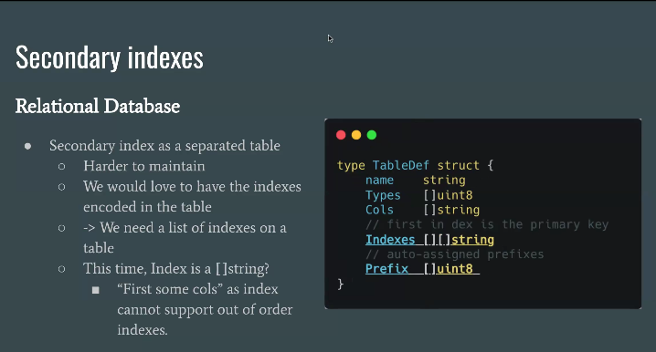

- What:
  - Store multiple indexes in the same table
  - Each index maps indexed columns -> primary key
  - Index entry structure:

- Why:
  - Pros:
    - Easy to search columns that are not primary key
    - Avoid maintaining multiple index tables

  - Cons:
    - Many duplicate indexes. For example: (c3), (c1, c3), (c2, c3) will turn into (c1, c2)

- How:
  ```go
  Indexes: [][]string {
  {"name"},
  {"city", "age"},
  }
  ```

### Option 3:

- What:
  - Avoid duplication by adding primary key to secondary key

- How:
  - IndexDef + metadata
    - What: Define index structure
    - Why:
      - Real index need more information: name of index, columns list, prefix(avoid duplicate index)
      - Easy to extend in the future (e.g. unique index, full-text index,...)
      - Support multiple indexes per table, each index can be composite of multiple columns
    - How:
      ```go
      type IndexDef struct {
          Name   string
          Cols   []string
          Prefix uint8
      }
      type TableDef struct {
          ...
          Indexes []IndexDef
      }
      ```

  - Hook Insert/Delete:
    - What: When inserting/deleting a row, also update secondary indexes
    - Why: Keep indexes in sync with table data
    - How:
      - On Insert:
        - For each index, extract indexed columns from row
        - Create index key: indexed columns + primary key
        - Insert into B+Tree index
      - On Delete:
        - For each index, extract indexed columns from row
        - Create index key: indexed columns + primary key
        - Delete from B+Tree index
      - On Update:
        - If indexed columns change:
          - Delete old index entry
          - Insert new index entry
        - If non-indexed columns change:
          - No action needed

  - Scanner abstraction
    - What: Provide a way to scan index entries
    - Why: Support index-based queries
    - How:

      ```go
      type Scanner struct {
        iter     *BIter
        mode     ScanMode
        tableDef *TableDef
        indexDef *IndexDef // nil if primary scan
        db       *DB
      }
      ```

      - Implement `Scan(startKey, endKey)` in B+Tree
      - Use iterator to traverse index entries in range

  - Test consistency:
    - Insert -> Scan index
    - Delete -> Scan index empty
    - Update indexed col → index changed
    - Update non-index col → index unchanged

### Secondary Index Updates with multi-key operations (TODO)

Why:

- When updating a row with many B-Tree keys (primary + secondary indexes), we need to:
  - Delete old index keys
  - Add new index keys

=> we need to know old index key

How:

```go
type UpdatedRec struct {
    tree  *BTree
    Added bool    // đã thêm key mới chưa
    Updated bool  // đã thêm key mới HOẶC key cũ đã thay đổi
    Old   []byte  // giá trị TRƯỚC khi update
    Key   []byte  // key hiện tại
    Val   []byte  // value hiện tại
    Mode  int
}

func dbUpdate(db *DB, tdef *TableDef, rec Record, mode int) (bool, error) {
    // 1. Insert row mới
    req := UpdatedRec{Key: key, Val: val, Mode: mode}
    if _, err := db.kv.Update(&req); err != nil {
        return false, err
    }

    // 2. Maintain secondary indexes
    if req.Updated && !req.Added {
        // Dùng req.Old để xóa các old indexed keys
    }

    if req.Updated {
        // Thêm các new indexed keys
    }

    return req.Updated, nil
}
```

### Note

- Atomicity Problem:
  - Each KV operation

# Transaction (TODO)

- Copy-on-write is not enough to ensure Atomicity

  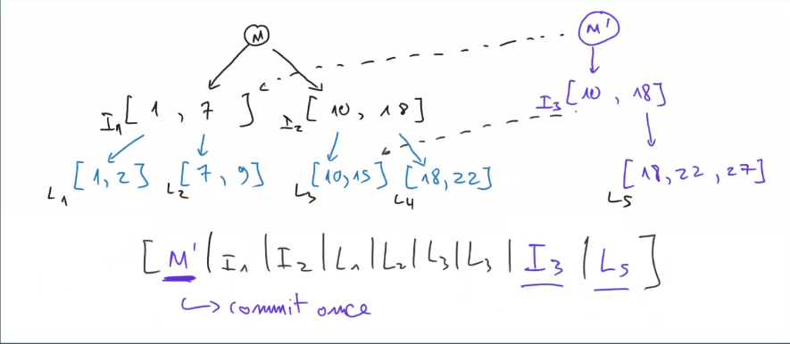

  Because transaction have many operations beside 1 update (many updates)

- KVTX struct:

  ```go
  // KVTX represents a transaction on the KV store
  type KVTX struct {
    kv      *KV
    meta    []byte               // for rollback
    version uint64               // version when TX started
    pending map[string]pendingOp // pending writes in this TX
    reads   []StoreKey           // keys read (for conflict detection)
    aborted bool                 // whether TX was aborted
  }
  // begin a transaction
  func (kv *KV) Begin(tx *KVTX)
  // end a transaction: commit updates; rollback on error
  func (kv *KV) Commit(tx *KVTX) error
  func (kv *KV) Abort(tx *KVTX)

  func (tx *KVTX) Get(key []byte) ([]byte, bool)
  ```

## Atomicity

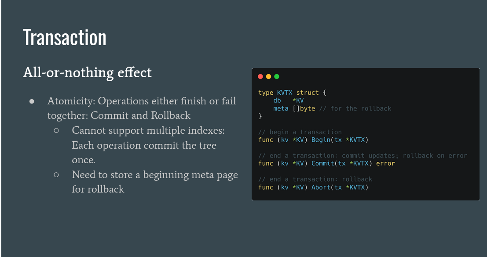

### How

#### Option 1: Copy-on-write

- Every (insert/update) don't upsert to the old data
- Alternatively:
  - Create a copy of changed node
  - Commit: change root pointer to new tree
  - Rollback: hold the old root pointer

=> Root pointer is single source of truth

#### Option 2: Write-Ahead Log (WAL)

- Updates are done in place on existing data pages
- Before modifying data pages:
  - Append change records to a log (WAL)
  - `fsync(log)` first
- Commit
- Rollback / Crash recovery: use WAL
- Data pages can be flushed later (async)

=> WAL is single source of truth

Choose option 1 for simplicity

```go
func (tx *KVTX) Seek(key []byte, cmp int) *BIter
func (tx *KVTX) Update(req *UpdateReq) bool
func (tx *KVTX) Del(req *DeleteReq) bool

type DBTX struct {
  kv KVTX
  db *DB
}

func (db *DB) Begin(tx *DBTX)
func (db *DB) Commit(tx *DBTX) error
func (db *DB) Abort(tx *DBTX)

func (tx *DBTX) Scan(table string, req *Scanner) error
func (tx *DBTX) Set(table string, rec Record, mode int) (bool, error)
func (tx *DBTX) Delete(table string, rec Record) (bool, error)
```

### Optimize

#### Reduce copying on multi-key updates

- Mark copied nodes
- Update in-place those copied nodes
- Update root pointer then `COMMIT`

#### Range delete

- Xác định range leaf nodes
- Giải phóng (free) cả leaf node
- Không cần đọc từng key
- Không cần update intermediate nodes nhiều lần

#### Compress common prefixes

- Trong 1 node:
  - Lưu prefix chung 1 lần
  - Mỗi key chỉ lưu phần suffix

## Durability

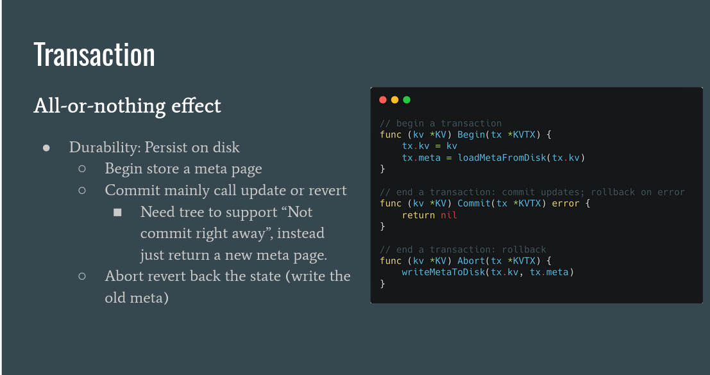

## Consistency

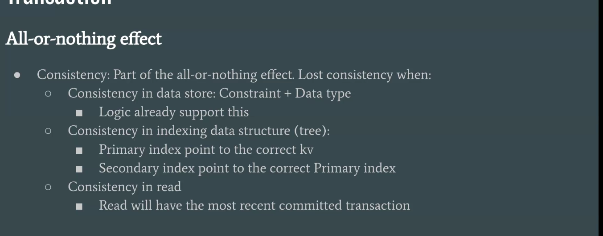

## Isolation

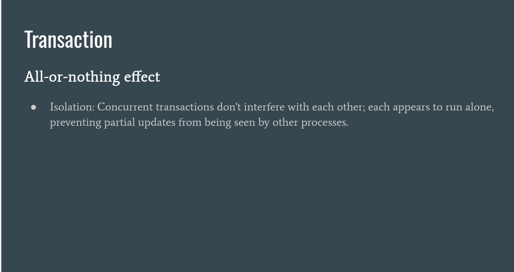

# Concurrency (TODO)

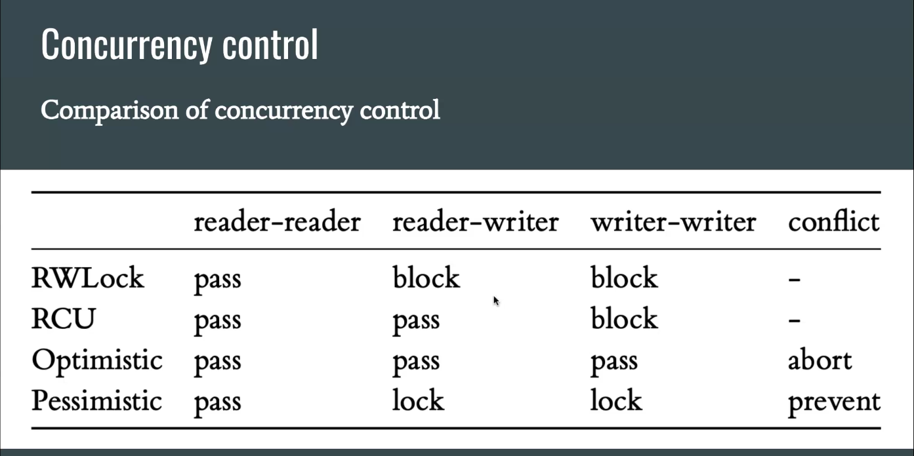
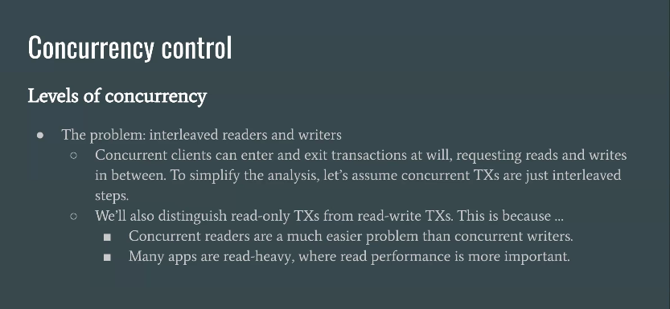
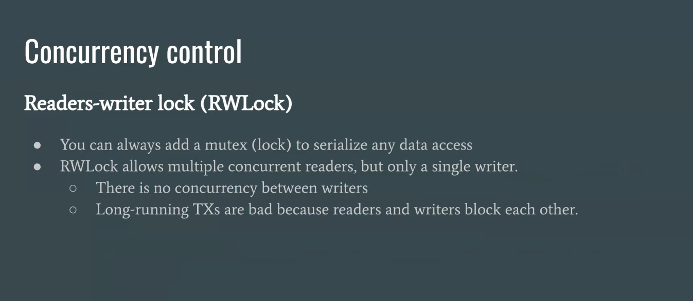
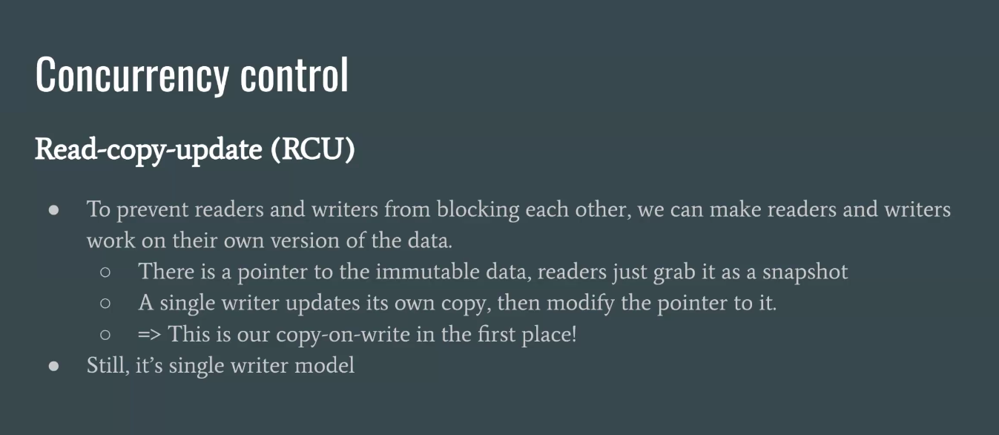
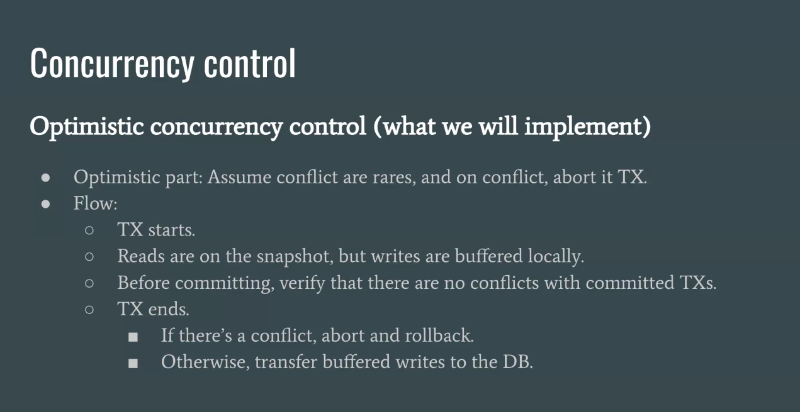
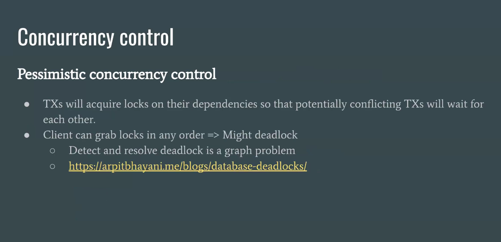
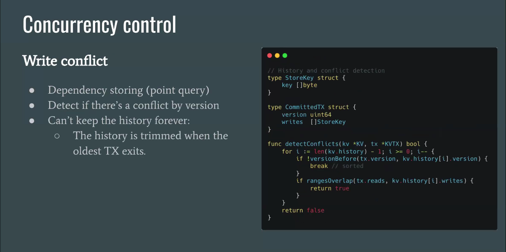

## What

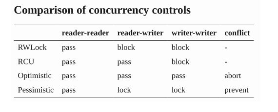

### Readers-writer lock (RWLock)

Why:

- Pros:
  - Concurrent reads

- Cons:
  - No concurrency between writes
  - Long-running TXs are bad because readers and writers block each other.

How:

- If there’s no writer, nothing can be changed, concurrent readers are OK.
- When a writer wants to enter, it waits until all readers have left.
- Readers are blocked by a writer, but not by other readers.

### Read-copy update (RCU)

What: we can make
readers and writers work on their own version of the data

Why:

- Pros:
  - Prevent readers and writers from blocking each other,

- Cons:
  - Only allow 1 writer at a time

How:

- There is a pointer to immutable data, reader just grab it as a snapshot
- A single writer updates its own copy, then flips the pointer to it

### Optimistic concurrency control (preffered)

What: One way to deal with conflicts is to just abort TX when a conflict is detected.

Why:

- Pros: Allow multiple readers and writers
- Cons: Slow when there are many conflicts

How:

- TX starts
- Reads are on the snapshot, but writers are buffered locally
- Before committing, verify that there are no conflicts with committed TXs.
- TX ends:
  - If there's a conflict, abort and rollback
  - Otherwise, transfer buffered writes to the DB

### Pessimistic concurrency control

What: TXs will acquire locks on their dependencies so
that potentially conflicting TXs will wait for each other

Why:

- Pros:
  - TXs can still progress even in conflicts

- Cons:
  - Deadlock (can solve but it is a hard graph problem)

## Snapshot isolation

# SQL Parser

## Syntax, parser, and interpreter

### What

- SQL is encoded into tree structure
  - Example 1: SELECT ... FROM foo WHERE a > b AND a < c:

    ```
    select
    /  |  \
    columns  table  condition
    ...      foo       and
                      /   \
                    >
                    / \   / \
                  a   b a   c
    ```

  - Example 2: Expression a + b \* c:
    ```
        +
      / \
      a   *
        / \
        b   c
    ```

  => All can be expressed by: SQL, PRQL, S-expression

## Query language specification

### Statements

Not exactly SQL, just a look-alike.

```sql
create table table_name (
  a type1,
  b type2,
  ...
  index (c, b, a),
  index (d, e, f),

  select expr... from table_name conditions limit x, y;
  insert into table_name (cols...) values (a, b, c)...;
  delete from table_name conditions limit x, y;
  update table_name set a = expr, b = expr, ... conditions limit x, y;
)
```

### 

### Conditions
