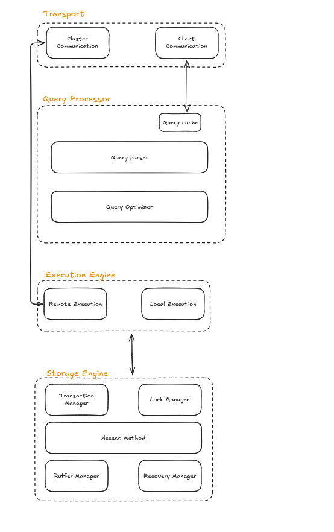
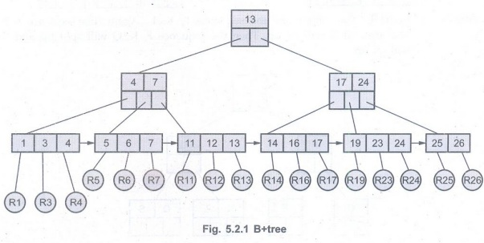
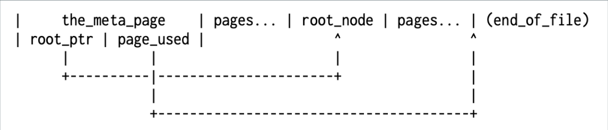
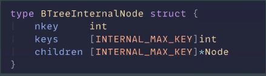
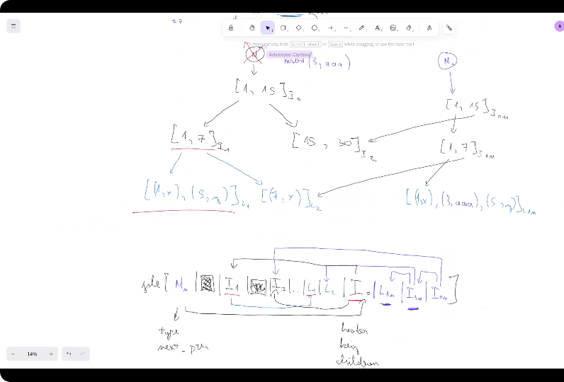
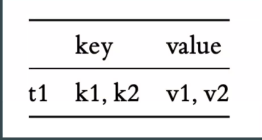
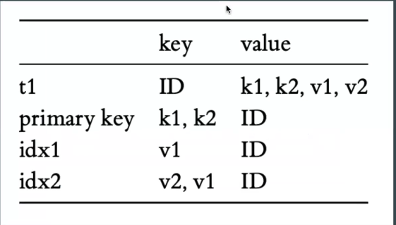
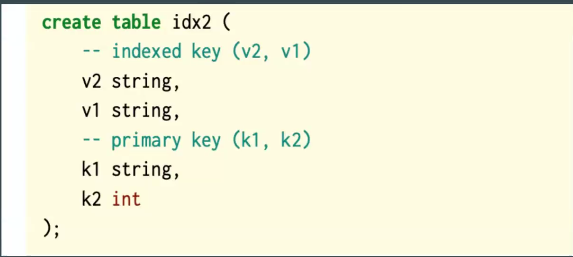
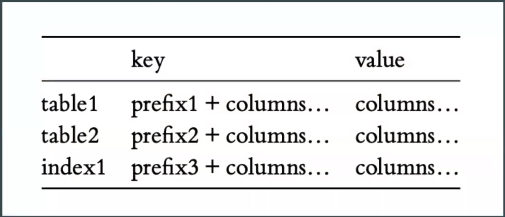

# Introduction

## What is database



- Transport:
  - **Cluster Communication**: Manage communication between nodes.
  - **Client Communication**: Receive query from users.

- Query Processor:
  - **Query Cache**: Store result of queries
  - **Query Parser**: Parse and check syntax error
  - **Query Optimizer**: Remove redundant and choose execution plan

- Execution Engine:
  - **Remote Execution**
  - **Local Execution**

- Storage Engine:
  - **Transaction Manager**: Manage transaction
  - **Lock Manager**: Manage lock to ensure data integrity when there are concurrent transactions
  - **Access Method / Index data structure**: Defines how data is physically stored, retrieved, and manipulated on disk (B+ Tree, Heap files)
  - **Buffer Manager**: Buffer to store data pages to increase query speed
  - **Recovery Manager**: Maintain WAL to restore data

- Note:
  - In this project, I will implement all of these features except the cluster communication and remote execution since it is quite complicated

## Why we need it

- Store data in more structured way

## What we will build

### Feature

- Query Cache
- Query Parser
- Query Optimizer
- Local Execution
- Transaction Manager
- Lock Manager
- Access Method (B+ Tree, LSM Tree)
- Recovery Manager (WAL)

# Access Method / Indexing Data Structure

To store data effectively, we need to optimize CRUD operations while minimizing disk access:

- RAM: 100ns
- SSD: 100us (1,000x slower than RAM)
- HDD: 100ns (100,000x slower than RAM)

To do that, we have the following data structures:

## Hashtable

### Pros

- Fast lookup: O(1)

### Cons

- **Ineffective for range queries**: Data is not stored in contiguous blocks
- **Depend on load factor**: load_factor = entries / buckets.
  - Too high -> slow
  - Too low -> CPU overhead

## Sorted array

### Pros

- Suitable for range queries

### Cons

- Update in O(N)

## Binary search

### Pros

- Effective for range queries
- All CRUD is O(logN) in average

### Cons

- Sometime update can cost O(N)
- Require many disk access -> I/O overhead

## BTree variant



### What

- A B-tree is a balanced n-ary tree, comparable to balanced binary trees. Each node stores variable number of keys (and branches) up to 𝑛 and 𝑛 > 2.
- B+Tree store values in the leaf only
- For example: PostgreSQL, MySQL, SQLite

### Pros

- Effective range queries
- Less disk access than Binary Search
- Stable CRUD: O(logN)

### Cons

- Expensive write (1 MB/s)
  - **Find insertion point**: access multiple nodes to find insertion points
  - **Rebalance tree**: split node if full (more I/O access)

### When

- Read heavy workload with occasional update: OLTP

### How

- Internal node: [bptree.go](/internal/storage/index/bptree.go)
- Leaf node: [bptree.go](/internal/storage/index/bptree.go)
- Insert function: [bptree.go](/internal/storage/index/bptree.go)

- Header
- MetaPage
- KeyEntry
- InternalPage
- Leaf
- Page Allocator
- Get / Set
- Del
- File Allocator with reuse

## LSM Tree (Log-Structured Merge Tree)

### What

- 2 files, a small file holding the recent updates, and a large file store the rest of the data. Updates go to small file first, it will be merged into the large file when it reaches a threshold.
- You can extend to multiple level: Small -> Medium -> Big...
- Update / Delete only mark an entry with a special flag, and smaller file hold more recent update
- For example: Cassandra, RocksDB, LevelDB, HBase, ScyllaDB,...

### Pros

- Good for write operations (100-500 MB/s)

### Cons

- **Read amplification**: one `Get()` operation must check data in various place (memtable -> SSTable). This make read performance is slower than traditional BTree
- **High Compactation cost**: Compaction process require high CPU usage

### How

### When

- Write heavy workload: Time-Series Data, Logging Systems, Messange Queues,...

# Disk-based data structure

- Data structure is designed to store directly on disk (HDD/SSD), not just in RAM

## Why

- **Persistence:** Data persists even after the system powers off
- **High Capacity:** Theses structures handle datasets that exceed RAM capacity by utilizing larger disk space
- **Performance:** B+ Trees optimize performance by fitting each node into a single disk page. This reduces tree height and minimizes expensive disk I/O operations

## How

### Option 1: Serializing the entire B+Tree

#### Cons

- Need to write / load for every operations
- Wasteful disk I/O (load unused node, write unchanged node)
- Full DB might not fit into memory

#### Note

- **Serialize:** Converts in-memory data structures into a byte stream for storage or transmission
- **Deserialize:** Reconstructs in-memory data structures from a byte stream

### Option 2: Page layout for B+Tree

#### What

- Page layout for B+Tree:
  - **Page:** A node with fixed size
  - **Page size:** Often multiply of 4KB (e.g. 8KB, 16KB), standard size of data chunks used by modern hard drives and file systems.
  - **Optimization:** Try to fit as much data into the 4 KB page for best performance

- Data persistent strategy:
  - **Copy-on-write:** Avoid modifying existing data. Instead, create and update a copy of the target node
  - **Path copying:** When a leaf node changes, create new copies of its parent nodes up to the root. This results in a new root pointer while preserving the old tree version.

- File layout
  - **Single-file structure:** The database resides in one file partitioned into pages.
  - **Page types:**
    - **Meta page:** The first page (Page 0), storing the latest root pointer and auxiliary metadata (root_ptr, page_used, page size, magic number, version,...).
    - **Node pages:** All subsequent pages, each storing a B+Tree node.
      

#### How

```
┌──────────────────────────┐
│        B+Tree            │  ← logic dữ liệu (keys, split, merge)
│  (Internal / Leaf node)  │
└───────────▲──────────────┘
            │ page abstraction
┌───────────┴──────────────┐
│           Pager           │  ← cache, read/write page
│  (pageID ↔ memory page)  │
└───────────▲──────────────┘
            │ blockID
┌───────────┴──────────────┐
│        Allocator          │  ← cấp phát block ID
│   (free list, next ID)   │
└───────────▲──────────────┘
            │ offset = id * BLOCK_SIZE
┌───────────┴──────────────┐
│           Disk            │
└──────────────────────────┘
```

- Internal page:
  - Keys right now is int, need to change to support bytes
  - Children is an array of pointer -> u64
  - Need a header that store the data type + next node
    

- Leaf page:
  - KeyVal struct:

    ```Go
    type KeyVal struct {
      keyLen uint16
      valLen uint16
      keys   [MAX_KEY_SIZE]uint8 // BigEndian storage
      vals   [MAX_KEY_SIZE]uint8 // BigEndian storage
    }
    ```

    For simplicity, I can use only array keys and vals but i think using the KeyVal struct will simplify the process of tracking keys and vals at the same time

  - `writeToBuffer` and `readFromBuffer` function is used to serialize / deserialize data into binary format at buffer

    ```
    // Write
    PUT(key, val)
      ↓
    insert into B+Tree
      ↓
    KeyVal.writeToBuffer(pageBuffer)
      ↓
    flush page to disk
    ```

    ```
    read page from disk
      ↓
    KeyVal.readFromBuffer(pageBuffer)
      ↓
    use key/value in query
    ```

- Page Allocator:
  - What: function return pointer to write data to

  - Why:
    - We know where is EOF to allocate data

- InsertResult:
  - What:
    - `nodePointer`: pointer (offset) to current node after inserting (or splitting)
    - `nodePromotionKey`: first key (smallest key) of the node
    - `newNodePointer`: if node is splited, this pointer will point to the new node
    - `newPromotionKey`: if node is splited, this key is the first key of new node and pushed to parent

  - Why: Transmit info of insert result to parent in order to update B+ Tree

- `readBlockAtPointer`
  - What: Funciton read a block of data (4096 bytes) from a file at a specified pointer (offset) into a buffer.
  - Why: To efficiently access any page (node) in the B+ Tree stored on disk, enabling reading of internal, leaf, or meta page as needed for tree operations
  - How:
    1. Resets the buffer
    2. Creates a 4096-byte slice
    3. Uses `file.ReadAt(data, int64(pointer))` to read exactly 4096 bytes from the file at the given offset
    4. Writes the data into the buffer for further processing

- Insert recursive function:

  ```
  FUNCTION InsertRecursive(node, key, keyValue):

    IF node is InternalPage:

        pos ← find child index where node.keys[pos] ≤ key

        IF node is empty:
            leaf ← new LeafPage
            leaf.insert(keyValue)
            leafPtr ← write leaf to disk
            node.insert(key, leafPtr)
            RETURN result(node)

        IF pos == -1:
            pos ← 0

        childPtr ← node.children[pos]
        child ← read page from disk at childPtr

        result ← InsertRecursive(child, key, keyValue)

        node.keys[pos] ← result.promotedKey
        node.children[pos] ← result.nodePtr

        IF result.newNodePtr exists:
            node.insert(result.newPromotedKey, result.newNodePtr)

        IF node is full:
            newNode ← split node
            oldPtr ← write node to disk
            newPtr ← write newNode to disk
            RETURN (oldPtr, promote(node), newPtr, promote(newNode))
        ELSE:
            ptr ← write node to disk
            RETURN (ptr, promote(node), null)

    ELSE:  // node is LeafPage

        node.insert(keyValue)

        IF node is full:
            newLeaf ← split node
            oldPtr ← write node to disk
            newPtr ← write newLeaf to disk
            RETURN (oldPtr, firstKey(node), newPtr, firstKey(newLeaf))
        ELSE:
            ptr ← write node to disk
            RETURN (ptr, firstKey(node), null)

  ```

- Insert function:
  - What:
    - Add a key-value pair to the disk-based B+Tree
    - Handle file access
    - Read/write page
    - Update tree structure as needed

  - Why:
    - Persistently store new data in B+ Tree index



# Data organization

- In a relational DB, data is modeled as 2D tables consisting of rows and columns
  - Primary key is used to identify rows.
  - Point query: Find a row by a given key.
  - Range query: Find rows by a range; iterate the result in sorted order

## Primary key
- How to encode a row as a KeyValue?
  - How to define primary key?
    - Option 1:

      
      - Primary key: key
      - All other columns: value

    - Option 2:

      

      - Primary key: Auto generated ID
      - All other columns: value

    => Option 1 for simplicity

- How to encode data to []byte?
  - In the KV structure, our key/value is []byte. So we need a way to:
    - Encoding a list of columns -> []byte
    - From []byte -> columns values

- What if we want secondary index?

  

  Use the same table and point secondary indexed key to primary key


## Schemas

- How to encode multiple table?

  

  - Option 1: Multiple KV stores
  - Option 2: 1 KV store, different prefix

## Tables

## Records

## CRUD
